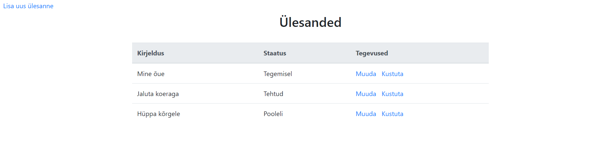

## Spring Boot CRUD application




A simple CRUD application to get more familiar with using Spring Boot for development.

Database: H2

View engine: Thymeleaf

## Run application
```
mvn spring-boot:run
```

## Open /tasks to use the application
```
Example: http://localhost:8080/tasks
```